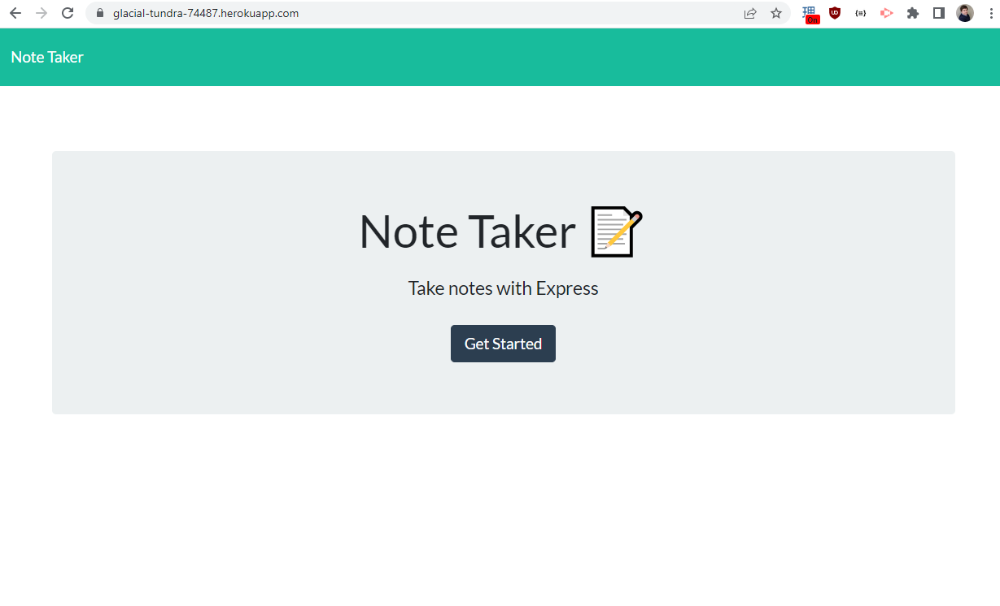
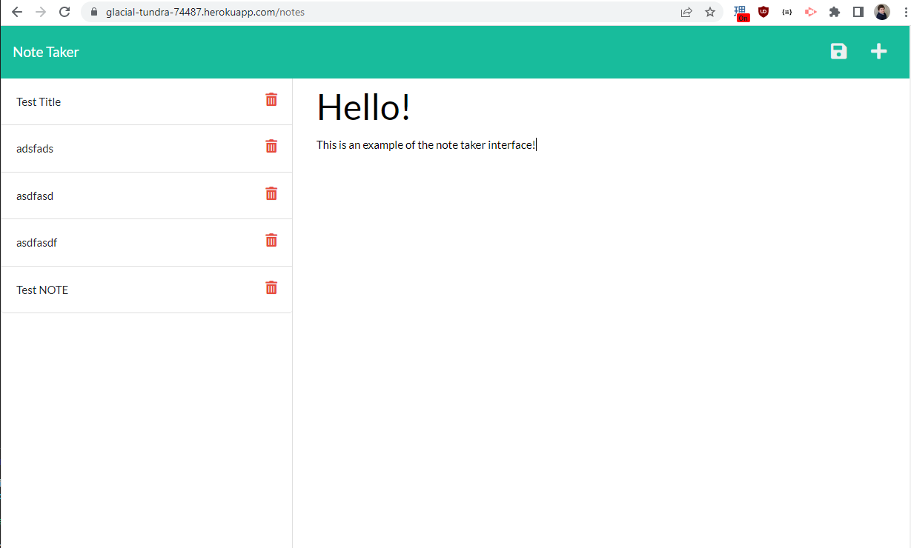

# Note Taking Application

## Description
This project sets out to create an application for taking and saving notes. Frontend functionality is written with javascript. It utilizes a combination of Node.js and Express.js for backend functionality. This project demonstrates knowledge of routing and GET and POST. Currently this application does not have delete button functionality (though the button itself is present). Delete functionality will be added in a future update.

## Table of Contents
 - [Description](#description)
 - [Installation](#installation)
 - [Usage](#usage)
 - [License](#license)
 - [Contributing](#contributing)
 - [Tests](#tests)
 - [Questions](#questions)
 ## Installation
N/A
 
 ## Usage

This application is hosted on Heroku at the following URL: https://glacial-tundra-74487.herokuapp.com/

[]
[]

## License
This application is not under any license.

## Contributing
Feel free to submit a pull request.

## Tests
N/A

## Questions
If you have any questions please feel free to reach out to me via email at DPAJBK@gmail.com
